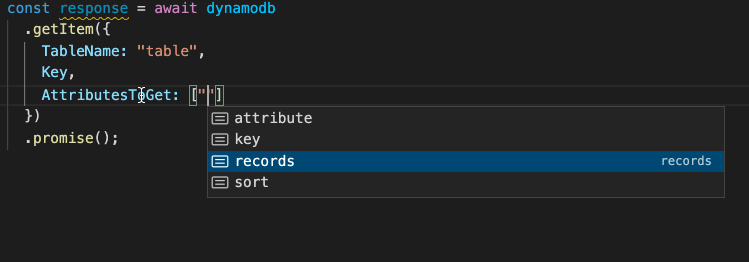

# typesafe-dynamodb

[](https://badge.fury.io/js/typesafe-dynamodb)

`typesafe-dynamodb` is a type-only library which replaces the type signatures of the AWS SDK's DynamoDB client. It substitutes `getItem`, `putItem`, `deleteItem` and `query` API methods with type-safe alternatives that are aware of the data in your tables and also adaptive to the semantics of the API request, e.g. by validating `ExpressionAttributeNames` and `ExpressionAttributeValues` contain all the values used in a `ConditionExpression` string, or by understanding the effect of a `ProjectionExpression` on the returned data type.

The end goal is to provide types that have total understanding of the AWS DynamoDB API and enable full utilization of the TypeScript type system for modeling complex DynmaoDB tables, such as the application of union types and template string literals for single-table designs.

## Installation

```
npm install --save-dev typesafe-dynamodb
```

## Usage

To use `typesafe-dynamodb`, there is no need to change anything about your existing runtime code. It is purely type definitions, so you only need to cast an instance of `AWS.DynamoDB` to the `TypeSafeDynamoDB<T, HashKey, RangeKey>` interface and use the client as normal, except now you can enjoy a dynamic, type-safe experience in your IDE instead.

```ts
import { DynamoDB } from "aws-sdk";

const client = new DynamoDB();
```

Start by declaring a standard TypeScript interface which describes the structure of data in your DynamoDB Table:

```ts
interface Record {
  key: string;
  sort: number;
  attribute: string;
  // all types are allowed, such as recursive nested types
  records?: Record[];
}
```

Then, cast the `DynamoDB` client instance to `TypeSafeDynamoDB`;

```ts
const typesafeClient: TypeSafeDynamoDB<Record, "key", "sort"> = client;
```

`"key"` is the name of the Hash Key attribute, and `"sort"` is the name of the Range Key attribute.

Finally, use the client as you normally would, except now with intelligent type hints and validations.

## Features

### Type-aware Input and Output

The type of the `Key` is derived from the `Record` type.


Same for the `Item` in the response:


### Filter result with ProjectionExpression

The `ProjectionExpression` field is parsed and applied to filter the returned type of `getItem` and `query`.


### Filter with AttributesToGet

If you specify `AttributesToGet`, then the returned type only contains those properties.



### Validate ExpressionAttributeNames and ExpressionAttributeValues

If you add a `ConditionExpression` in `putItem`, you will be prompted for any `#name` or `:valu` placeholders:


Same is true for a `query`:


