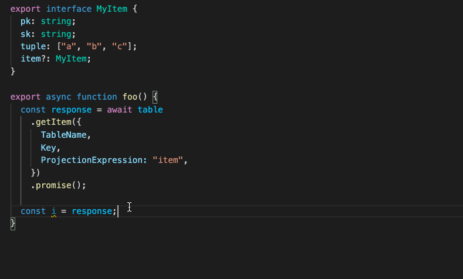

# typesafe-dynamodb

This is a type-only library for replacing the AWS SDK for DynamoDB's `getItem`, `putItem`, `deleteItem` and `query` API calls with type-safe alternatives that are aware of the data in your Tables and also adaptive to the semantics of the API request, such as understanding the effect of a `ProjectionExpression`.

## Installation

```
npm install --save-dev typesafe-dynamodb
```

## Usage

To use `typesafe-dynamodb`, there is no need to change anything about your existing runtime code. simply cast an instance of `AWS.DynamoDB` to the `TypeSafeDynamoDB<T, HashKey, RangeKey>` and use the client as normal.

```ts
import { DynamoDB } from "aws-sdk";

const dynamodb = new DynamoDB();
```

Declare standard TypeScript types to represent the data in your table:

```ts
interface Record {
  key: string;
  sort: number;
  attribute: string;
  // all types are allowed, such as recursive nested types
  records?: Record[];
}
```

Then, cast the `DynamoDB` client instance to `TypeSafeDynamoDB`;

```ts
const typesafe = dynamoDB as TypeSafeDynamoDB<Record, "key", "sort">;
```

`Record` is a TypeScript type definition describing the data in the table, `"key"` is the name of the Hash Key attribute, and `"sort"` is the name of the Range Key attribute.

Then, use the client as you normally would, except now with intelligent type hints and validations.

## Features

### Type-aware Input and Output

The type of the `Key` is derived from the `Record` type.


Same for the `Item` in the response:


### Filter result with ProjectionExpression

The `ProjectionExpression` field is parsed and applied to filter the returned type of `getItem` and `query`.



### Filter with AttributesToGet

If you specify `AttributesToGet`, then the returned type only contains those properties.


### Validate ExpressionAttributeNames and ExpressionAttributeValues

If you add a `ConditionExpression` in `putItem`, you will be prompted for any `#name` or `:valu` placeholders:


Same is true for a `query`:


